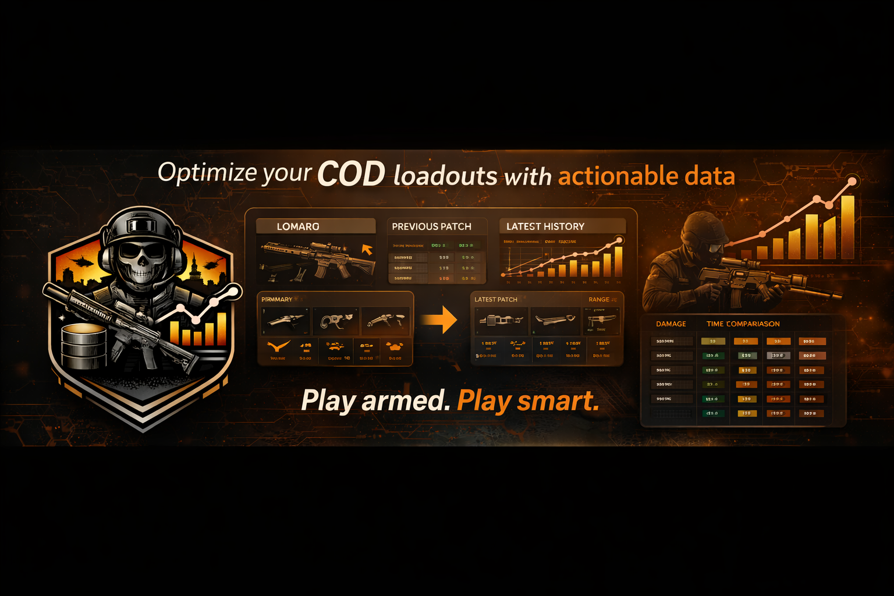

# Cod Armory Lab

> **Play armed. Play smart.**

Cod Armory Lab is a **player‑centric platform** designed to help players stay optimally equipped across patches, seasons, and balance updates.

While the project is currently **private**, its vision remains deeply rooted in the **gaming experience**: helping players consistently make the **right loadout choices**, without exposing them to unnecessary technical or analytical complexity.

---

## 🎮 What is Cod Armory Lab?

Cod Armory Lab is an internal platform that structures and tracks **weapons, attachments, and loadouts** over time, ensuring they remain comparable before and after every patch.

Patch changes, renames, balance adjustments, and removals are handled in a way that preserves **history, clarity, and player relevance**.

The player never needs to think about versions or data pipelines — the system exists solely to support **better in‑game decisions**.

---

## ❓ Why this project exists

In Call of Duty‑style games, frequent patches constantly reshape the meta:

* Weapons are buffed or nerfed
* Attachments change behavior
* Popular loadouts become obsolete overnight

Most tools focus on **raw stats or analytics**, forcing players to interpret complex data themselves.

Cod Armory Lab exists to solve this differently:

* Keep **history intact**
* Make **comparisons reliable**
* Let data work **quietly in the background**

So players can focus on what matters: **being ready for the fight**.

---

## ✅ What it gives players

* Confidence that a loadout choice is still relevant
* Clear before / after patch comparisons
* Historical visibility without information overload
* Consistency across seasons and balance passes

In short:

> **Better gear choices, with zero cognitive friction.**

---

## 🧠 Core Principles

### Player‑first mindset

Data is never the product. **The player’s decision is.**

### Immutable identity

Weapons and attachments keep stable technical identifiers across all patches.

### Patch‑based evolution

Balance changes are applied as **overrides**, never by rewriting history.

### Transparent tooling

Graphs and comparisons support decisions without demanding interpretation.

---

## 🧩 Ecosystem

Cod Armory Lab is composed of several internal components:

* **cod-armory-lab-api**
  Core resolution engine serving patch‑accurate snapshots

* **cod-armory-lab-data**
  Versioned weapon, attachment, and patch datasets

* **cod-armory-lab-cli**
  Tooling for validation, diffing, and changelog generation

* **cod-armory-lab-web** *(planned)*
  Player‑facing interface for comparison and exploration

Each component is designed to evolve independently while remaining consistent with the global vision.

---

## 🛠️ Project Status

* 🔒 Private repository
* 🚧 Active development
* 🧪 Models and foundations stabilizing
* 🎮 Strong focus on long‑term player relevance

The current priority is building a **robust and future‑proof foundation** before any public exposure.

---

## 👥 Team & Collaboration

Even as a private project, Cod Armory Lab is built with **future collaboration** in mind:

* Clear conventions
* Strong documentation
* Shared player‑centric culture

New contributors should always ask:

> *Does this help the player make a better choice?*

If the answer is yes, the change is aligned with the project.

---

## 📄 Branding

Visual and identity guidelines are documented in:

* `BRANDING.md`

All visuals, UI work, and communication should follow these principles to preserve coherence.

---

## 🧭 Final Note

Cod Armory Lab is not about chasing the meta.

It is about **understanding it**, respecting its history, and giving players the tools to stay prepared — patch after patch.
